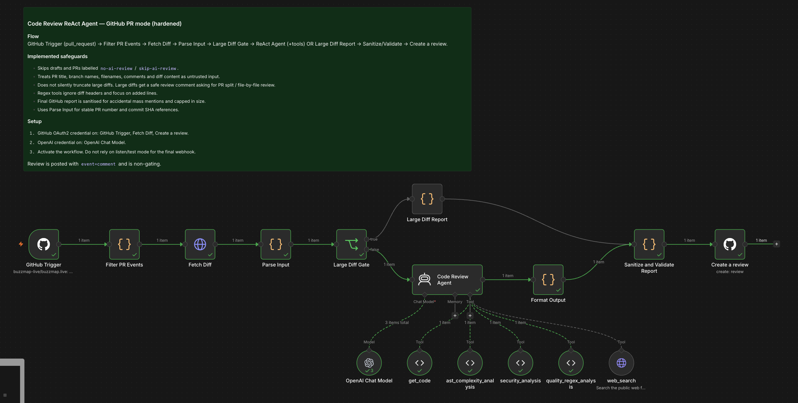
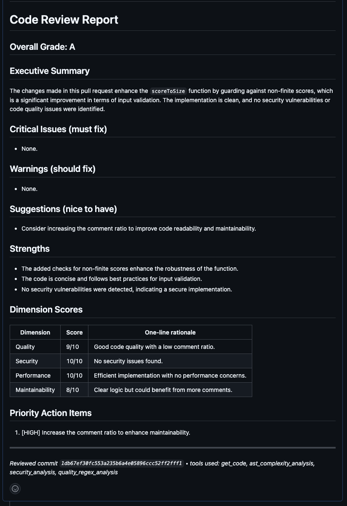
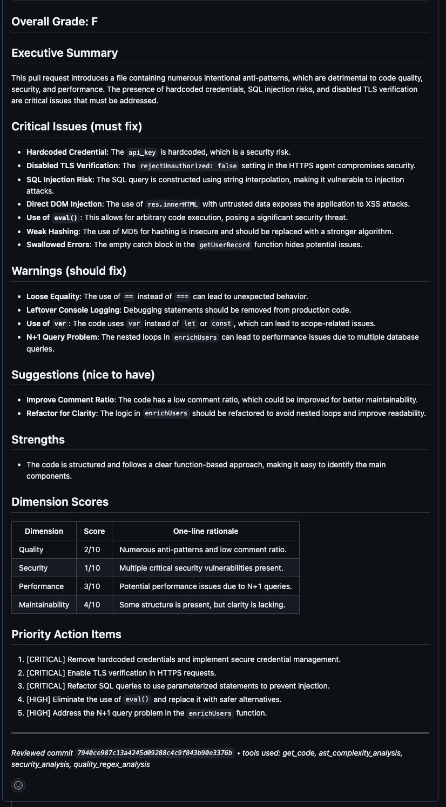

# n8n Workflows

This folder contains importable n8n workflow templates.

## Code Review ReAct Agent (GitHub PR)

File: `Code Review ReAct Agent (GitHub PR).json`

This workflow reviews GitHub pull requests with a hardened ReAct-style AI agent. It listens for GitHub `pull_request` events, fetches the PR diff, runs deterministic code review tools, validates the final report, and posts the result back to the pull request as a non-blocking GitHub review comment.

### Example Output

Passing review example:

Failing review example:

### Workflow

1. `GitHub Trigger` receives pull request events.
2. `Filter PR Events` keeps relevant PR activity and skips draft or opt-out labelled PRs.
3. `Fetch Diff` downloads the pull request diff from GitHub.
4. `Parse Input` prepares the diff and context for the agent.
5. `Large Diff Gate` prevents partial reviews of oversized diffs.
6. `Large Diff Report` posts a safe fallback report when the PR is too large for single-pass review.
7. `Code Review Agent` reviews normal-sized diffs using these tools:
   - `get_code`
   - `ast_complexity_analysis`
   - `security_analysis`
   - `quality_regex_analysis`
   - `web_search`
8. `Format Output` prepares the final report.
9. `Sanitize and Validate Report` checks required sections, caps report size, and removes unsafe mention patterns.
10. `Create a review` posts the review comment to GitHub.

### Safeguards

- Skips draft PRs and PRs labelled `no-ai-review`, `skip-ai-review`, or `ai-review-skip`.
- Treats PR titles, branch names, filenames, comments, and diff content as untrusted input.
- Avoids silent truncation by posting a large-diff fallback report when the diff exceeds the configured limit.
- Scans added diff lines while ignoring diff headers.
- Sanitizes final GitHub output before posting.
- Uses parsed PR metadata for stable pull request number and commit SHA references.

### Requirements

- n8n with LangChain nodes available.
- GitHub OAuth2 credential in n8n.
- OpenAI API credential in n8n.
- Repository permissions that allow reading pull requests and creating pull request reviews.

### Import

1. Open n8n.
2. Go to **Workflows**.
3. Select **Import from File**.
4. Choose `Code Review ReAct Agent (GitHub PR).json`.
5. Reconnect credentials for:
   - `GitHub Trigger`
   - `Fetch Diff`
   - `Create a review`
   - `OpenAI Chat Model`

### Configure

After import, update the GitHub owner and repository values in both:

- `GitHub Trigger`
- `Create a review`

The exported workflow currently contains example repository values from the source environment. Replace them with the target repository before activating the workflow.

The `OpenAI Chat Model` node uses `gpt-4o-mini` with temperature `0.2`. Adjust the model only if your n8n instance has a different approved model or budget requirement.

### Activate

Activate the workflow in n8n after credentials and repository values are configured. An active workflow registers the real GitHub webhook. Test/listen mode is not enough for production PR review automation.

By default, the workflow posts reviews with `event=comment`, so it does not block merges. To make the review gating, update the `Create a review` node event setting according to your repository policy.
