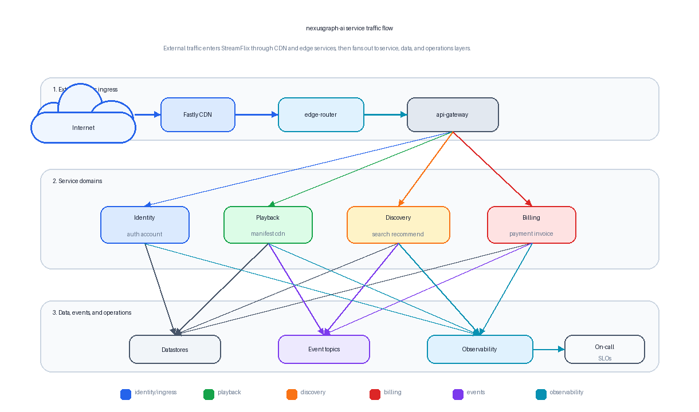

# nexusgraph-ai

GraphRAG for Organizational Knowledge and Decision Intelligence.

`nexusgraph-ai` models organizational knowledge as a graph of people, teams, projects, services, documents, decisions, tools, audits, and incidents. It uses GraphRAG to answer relationship-heavy questions that traditional vector RAG struggles with, such as identifying who worked on a compliance audit, which tools were used, what decisions were made, and who approved them.

## Quick Start With Docker

```bash
cd /path/to/nexusgraph-ai
cp .env.example .env
```

For the simplest fully local run, set the LLM provider in `.env` to Ollama:

```env
LLM_PROVIDER=ollama
OLLAMA_MODEL=llama3
```

Start the full stack:

```bash
docker compose up -d --build
```

On first run, make sure the local Ollama model is available:

```bash
docker compose exec ollama ollama pull llama3
```

The `app` container automatically imports the Neo4j graph and ingests ChromaDB
documents before starting Streamlit. You do not need to run graph or vector
ingestion manually for the normal demo path.

Open these local URLs:

- Streamlit app: http://localhost:8501
- Neo4j Browser: http://localhost:7474
- Ollama API: http://localhost:11434

Neo4j credentials:

```text
username: neo4j
password: nexusgraph-local
```

Check container status:

```bash
docker compose ps
```

Follow app logs:

```bash
docker compose logs -f app
```

Stop the stack:

```bash
docker compose down
```

Remove local Docker volumes as well:

```bash
docker compose down -v
```

## Architecture Diagram



A simpler static traffic-flow diagram. Detailed diagram source remains available as [`architecture-diagram.svg`](architecture-diagram.svg) and [`docs/architecture-diagram.mmd`](docs/architecture-diagram.mmd).

## Dataset

The project uses a fictional streaming company dataset:

```text
StreamFlix Organizational Knowledge Dataset
```

The current seed graph contains people, teams, projects, services, skills, tools, documents, decisions, incidents, audits, vendors, systems, on-call schedules, current on-call assignments, dashboards, runbooks, escalation policies, SLO metrics, datastores, event topics, architecture docs, OpenAPI specs, Kubernetes manifests, and Terraform references. It also incorporates missing service-dependency and operational documentation concepts from the Netflix synthetic service dataset. Source artifacts live in `data/`, while graph import artifacts live in `graph/`.

## Deliverables

```text
README.md
Dockerfile
docker-compose.yml
.env.example
requirements.txt
data/
graph/
src/
app/
evaluation/
docs/
```


## Manual Data Commands

The Vector RAG baseline uses ChromaDB as a local persistent vector database. Chroma keeps the local setup simple: no external API keys, no managed service dependency, and a persistent store under `vector_store/chroma`.

The Docker entrypoint already runs these ingestion commands. Use the manual
commands below only when you want to re-run a specific step inside an already
running container.

Import the graph into Neo4j:

```bash
docker compose exec app python src/import_to_neo4j.py
```

Dry-run document preparation:

```bash
docker compose exec app python src/vector_ingest.py --dry-run
```

Ingest into ChromaDB:

```bash
docker compose exec app python src/vector_ingest.py
```

Query the vector store:

```bash
docker compose exec app python src/vector_query.py "Who is on call for playback-service?" --n-results 5
```

Generate a readable Vector RAG answer from retrieved chunks:

```bash
docker compose exec app python src/vector_rag.py "Who is on call for playback-service?" --n-results 5
```

The initial ingestion includes graph nodes, graph relationships, YAML source data, docs, and evaluation artifacts.

## Optional Hosted LLM Providers

The app can also use hosted LLM providers. Set `LLM_PROVIDER` in `.env` to one
of `openai`, `gemini`, or `groq`, then provide the matching API key:

```env
LLM_PROVIDER=openai
OPENAI_API_KEY=...
```

```env
LLM_PROVIDER=gemini
GOOGLE_API_KEY=...
```

```env
LLM_PROVIDER=groq
GROQ_API_KEY=...
```

Restart the app after changing `.env`:

```bash
docker compose restart app
```

## Current Implementation Notes

The Streamlit demo includes:

1. GraphRAG and Vector RAG side-by-side comparison.
2. Collapsed JSON response expanders for each answer panel.
3. Behind-the-scenes trace timelines and evidence cards.
4. Neo4j graph import and ChromaDB vector ingestion during container startup.
5. A software catalog explorer and graph preview for the synthetic Streamflix dataset.
